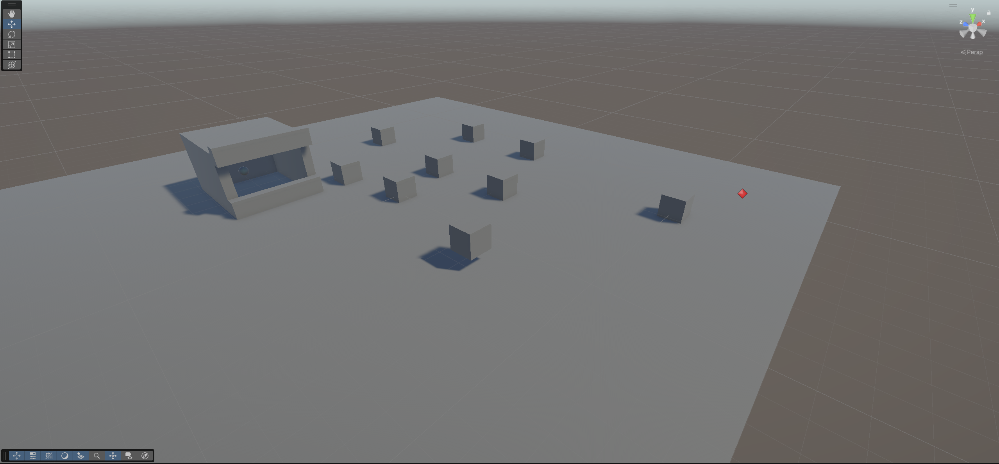
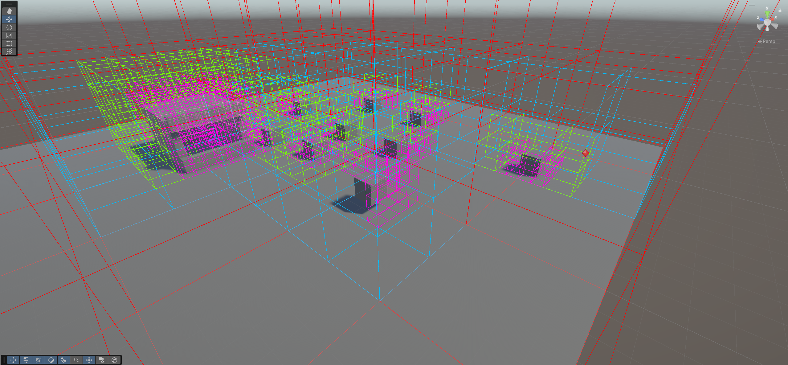
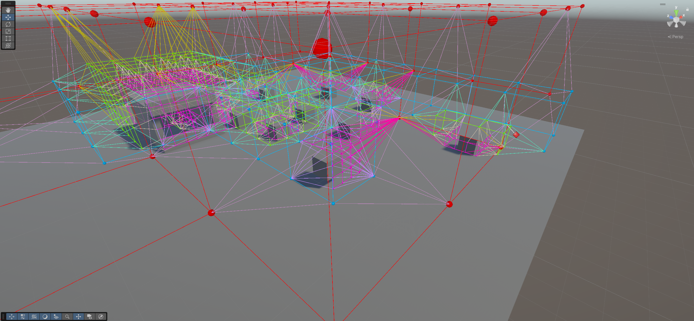
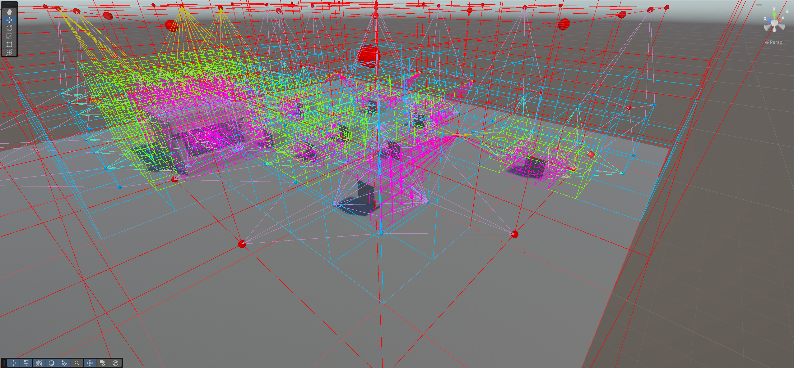

# Rusleo Voxel Pathfinding

---





---
Воксельная система поиска пути для 3D‑сцен в Unity с поддержкой **LOD**, гибридной **статической/динамической** сетки, построением графа и сглаживанием траекторий (Bezier/сплайны). Проект включает наглядные **Gizmos**‑визуализаторы и демо‑скрипты перемещения (пчёлы).

## 🧠 Ключевые возможности
- **Иерархическая воксельная сетка (LOD)**: рекурсивная генерация узлов и соседей; деление занятых вокселей и хранение связей по 6 направлениям.  
- **Построение графа из сетки**: преобразование вокселей свободного пространства в узлы графа с двунаправленными рёбрами; поиск «соседей по касанию» между вокселями разных родителей.  
- **Поиск пути (A\*)**: выбор ближайших узлов/вокселей для старта/финиша, эвристика по квадрату Евклида, восстановление пути по родителям.  
- **Сглаживание траекторий**: «warp»‑маршрут на границах вокселей/параллелепипедов; примеры B‑сплайна и Catmull‑Rom для плавного движения.  
- **Демо‑перемещение**: `BeeMover` с шумовым «шевелением» (Perlin), ограничением дельты скорости и поворотом по вектору движения.  
- **Gizmos‑отрисовка**: визуализация сетки (по LOD), узлов/рёбер графа и разных типов путей (обычный/варп/сплайн).

## 🏗 Архитектура (модули)
- **Core** — базовые сущности графа и пути: `Node`, `Path`, `BSpline` и др.  
- **StaticGrid** — построение статической LOD‑сетки и соседей вокселей.  
- **Graph** — преобразование сетки в граф и соединение узлов.  
- **Pathfinding** — A\*, утилиты траекторий (warp/merge), билдер пути, демо‑перемещения (пчёлы, сплайн).  
- **GizmosDebug** — отрисовщики сетки/графа/пути.  
Структура папок и пояснения к модулям — см. документ «ProjectStructure» (в проекте).

## 📦 Состав (основные классы)
- `Voxel`, `BaseGrid`, `GridBuilder` — создание LOD‑сетки, рекурсивное деление занятых вокселей, установка соседей (‑x/+x/‑y/+y/‑z/+z).  
- `BaseGraph`, `GraphBuilder`, `GridToGraphConverter` — получение узлов из свободных листьев и соединение соседей (включая поиск «смежного» по родителю/детям).  
- `PathfindingUtility` — A\* (open/closed, G/H/F, retrace), warp‑алгоритм по пересечениям линии с боксом, merge точек по дистанции.  
- `PathBuilder` — построение пути по ближайшим узлам/вокселям старта/финиша; получение как «обычной» последовательности, так и «warped» списка точек.  
- `BeeMover` — движение вдоль warped/Bezier‑точек с шумом и ограничением `VelocityChange`.  
- `GraphDrawer`, `GridDrawer`, `PathDrawer` — визуализация узлов/рёбер/вокселей и типов маршрутов (Default / Warped / Spline).

## 🚀 Быстрый старт
1. Склонируйте репозиторий и откройте проект в **Unity** (LTS 2022.x+).  
2. На сцене создайте:
   - `GridBuilder` (укажите размеры сетки, размер вокселя LOD0, `LayerMask`, глубину LOD).  
   - `GraphBuilder` (ссылку на `GridBuilder`).  
   - `PathBuilder` (ссылку на `GraphBuilder`, объекты **Bee** и **Target**).  
   - (Опционально) `BeeMover` на объекте пчелы, укажите `PathBuilder` и целевой `Transform`.  
3. Включите отрисовку через компоненты `GridDrawer`/`GraphDrawer`/`PathDrawer` (выберите тип пути в `PathDrawer`).  
4. Нажмите **Play** и наблюдайте построение сетки → графа → пути и перемещение агента.

## ✨ Примеры использования
- Построение сетки и графа на сцене: контекстное меню **Build Grid/Graph** в инспекторе билдера.  
- Поиск пути в рантайме:
  ```csharp
  var path = pathBuilder.BuildPath(start.position, end.position);
  // path.PathNodes — основной путь; pathBuilder.GetWarpedPath() — сглаженный «warped».
  ```
- Сглаживание:
  - `PathfindingUtility.WarpPath(path, out warpedPoints)` — пересечения с боксами вокселей, точки на гранях.  
  - `BSpline` / `SplineMover` — примеры плавного прохода по контрольным точкам.

## 🛣 Roadmap / TODO
- Поиск **реально достижимой** ближайшей точки для агента: учитывать препятствия через `Voxel.IsCollided` (не только геометрию расстояния).  
- Оптимизировать маршрут: избегать «прохода через центр» вокселей при формировании опорных точек.  
- Уточнить и документировать кривые **Bezier/сплайны** (выбор степеней, генерацию узловых векторов, параметризацию по длине дуги).

---

✦ Автор: [Rusleo](https://github.com/razrabVkedah)
